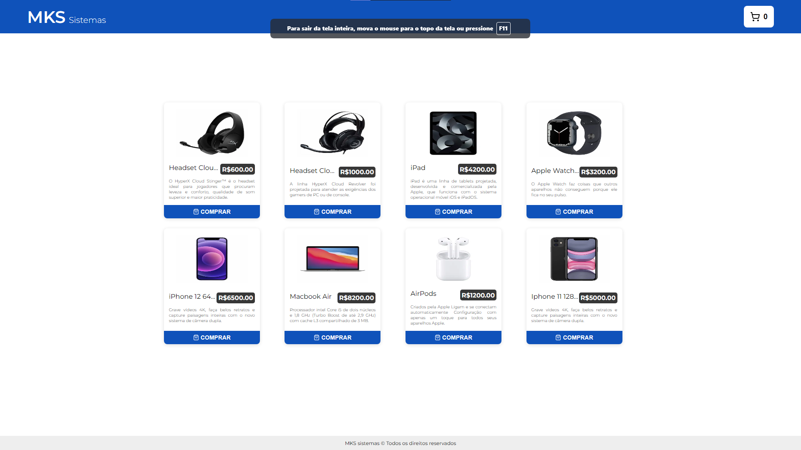

Diretrizes do desafio
===========================

O propósito primordial desta avaliação consiste em analisar sua proficiência na elaboração de código que seja claro, meticulosamente testado e passível de reutilização. Ao concluir a tarefa, solicitamos a gentileza de proceder com o deployment da aplicação e de nos fornecer, concomitantemente, os links correspondentes ao aplicativo e ao repositório associado. Este procedimento possibilitará uma análise abrangente do seu desempenho, sendo de suma importância para o desdobramento subsequente do processo avaliativo.

Tarefa (funcional)
---------------

Para esse desafio, você deve consumir nossa [API REST de produtos](https://mks-frontend-challenge-04811e8151e6.herokuapp.com/api-docs/) para exibir a lista de produtos da loja.

A aplicação deve conter apenas uma página/rota e um carrinho.

- <b>Loja</b>: A lista de produtos deve ser buscada de nossa API, use um shimmer/skeleton enquanto estiver em loading.
 
- <b>Carrinho</b>: O carrinho deve conter todos os produtos selecionados, juntamente com a opção de aumentar a quantidade de cada produto selecionado.

Use do Jest e a testing-library para realizar os testes unitários.

Recursos
---------------

UI/UX: [Figma loja](https://www.figma.com/file/ay9JKCd6LKvKLE7TclJJkX/MKS-Front-end-challenge?type=design&node-id=0%3A1&mode=design&t=AlZMI9zkOlhrx6JF-1) PS: O design system está incluso, incluindo a fonte.

API: [API REST de produtos](https://mks-frontend-challenge-04811e8151e6.herokuapp.com/api-docs/) para exibir a lista de produtos da loja.

Ferramentas requeridas
---------------

1. TypeScript
2. React ou Next.js (Preferimos Next.js)
3. React-query
4. Styled-components ou SASS
5. Framer-motion
6. Jest

Aspectos técnicos
---------------

Todas as ferramentas previamente elencadas são consideradas requisitos essenciais e, portanto, imprescindíveis para a realização deste projeto. Adicionalmente, sinta-se à vontade para empregar qualquer outra tecnologia que julgar pertinente e confortável para o desenvolvimento do mesmo. A flexibilidade para a utilização de recursos adicionais visa propiciar um ambiente propício à expressão de suas habilidades e à implementação de soluções que melhor se alinhem à sua abordagem e experiência.

Faça o deploy!
---------------

Ao concluir o desenvolvimento, proceda com o deployment da aplicação no ambiente que lhe for mais conveniente, como por exemplo, AWS Amplify, Vercel, Netlify, Heroku, Amazon EC2, App Runner, entre outros. A escolha da plataforma de hospedagem fica a seu critério, sendo essencial assegurar que o aplicativo esteja acessível de maneira estável e eficaz para a avaliação subsequente.